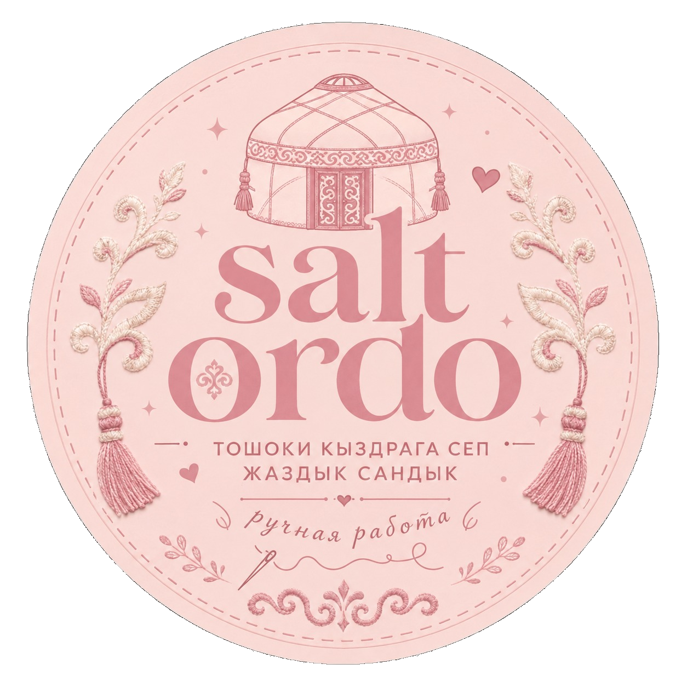

<div align="center">



# SALT ORDO

**Каталог домашнего текстиля · индивидуальные заказы · система продаж**


</div>

---

## Что находится на сайте

| Покупатель | Администратор |
|---|---|
| Главная и каталог | Dashboard |
| Поиск, категории и фильтры | Товары и категории |
| Скидки и акции | Себестоимость, цена и маржа |
| Карточка товара + галерея фото | Акции и сроки скидок |
| Избранное и корзина | Заказы и клиенты |
| Заявка → WhatsApp | Сотрудники и роли |
| Индивидуальный заказ в любом стиле | Настройки сайта |
| Доставка по всему Кыргызстану | Supabase Auth + RLS + Storage |
| — | Доступ только через `/admin` |
| Русский · Кыргызский · English | Тексты товара RU · KG · EN |

---

## Логика

```text
Покупатель → Каталог → Товар → Корзина → Заявка → WhatsApp

/admin → Авторизация сотрудника → Товары / Заказы / Команда / Настройки
```

Каталог изначально пустой. Товары, категории, цены, скидки, фотографии и остатки добавляются только из админ-панели.

---

## Технологии

**React · Vite · JavaScript · CSS · Supabase PostgreSQL · Auth · Storage · RLS · Edge Functions**

Адаптивность: **Desktop · Laptop · Tablet · Mobile**.
